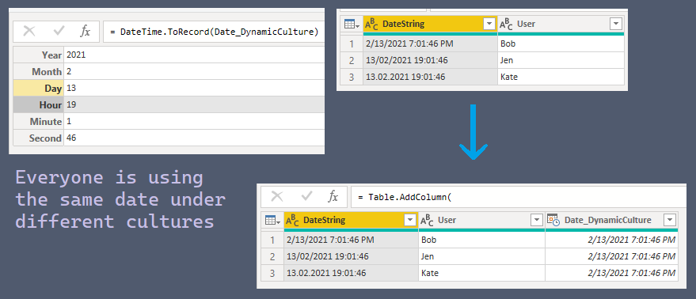

- [PowerQueryLib: ExampleReports](#powerquerylib-examplereports)
  - [Web Methods](#web-methods)
  - [Dates, DateTimes using `culture`](#dates-datetimes-using-culture)

# PowerQueryLib: ExampleReports

Examples using [PowerQueryLib](https://github.com/ninmonkey/Ninmonkey.PowerQueryLib)

## Web Methods

[Fire multiple HTTP requests based on a table.pbix](./Reports/HTTP%20Methods/HTTP%20Methods.pbix)

[Get HTTP Response Details.pq](./Reports/Web.Contents%20-%20status%20handling/Web.Contents%20-%20response%20details%20like%20SSL%20handshake%20failed.pq), [Get HTTP Response Details.pbix](./Reports/Web.Contents%20-%20status%20handling/Web.Contents%20-%20response%20details%20like%20SSL%20handshake%20failed.pbix)

## Dates, DateTimes using `culture`

[DateTime.From culture.pq](./Reports/culture/dynamically_import_dates_from_multiple_cultures.pq), [DateTime.From culture.pbix](./Reports/culture/dynamically_import_dates_from_multiple_cultures.pbix)
