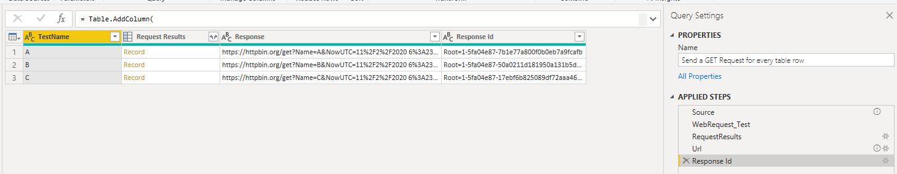

# PowerQueryLib: ExampleReports

Examples using [PowerQueryLib](https://github.com/ninmonkey/Ninmonkey.PowerQueryLib)

https://github.com/ninmonkey/PowerQuery-ExampleReports/tree/main/Reports/HTTP%20Methods

## Web Methods

Fire multiple HTTP requests based on a table

